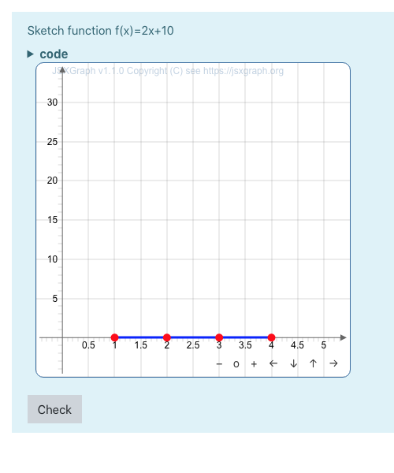
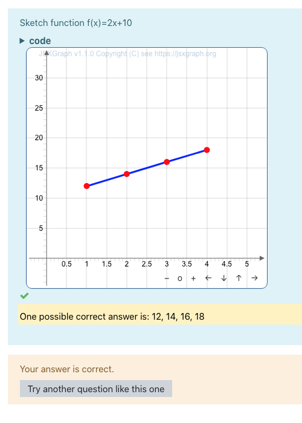
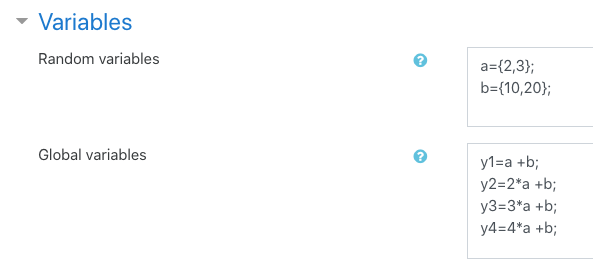
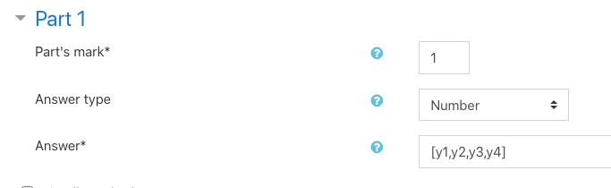

# Formulas extension for Moodle JSXGraph filter

The [moodle question type formulas](https://moodle.org/plugins/qtype_formulas), see also <https://moodleformulas.org>, allows to create questions containing random values and multiple answer fields.
This extension was created for the [Moodle JSXGraph filter](https://github.com/jsxgraph/moodle-filter_jsxgraph) and is used to use JSXGraph constructions in formulas questions.
It supplies the transfer of values between the formulas question and [JSXGraph](https://jsxgraph.org) constructions. 

### About JSXGraph

JSXGraph is a cross-browser JavaScript library for interactive geometry, function plotting, charting, and data visualization in the web browser.
JSXGraph is implemented in pure JavaScript and does not rely on any other library. Special care has been taken to optimize the performance.

Have a look at [www.jsxgraph.org](https://jsxgraph.org/).

### About Moodle JSXGraph filter

The [Moodle JSXGraph filter](https://github.com/jsxgraph/moodle-filter_jsxgraph) is a plugin for [Moodle](http://moodle.org) to enable function plotting and dynamic geometry constructions with [JSXGraph](http://jsxgraph.org) within a Moodle platform.

*The plugin for Moodle also contains these files.*

## Installation

This extension does not need to be installed separately. 
Instead, it is already included in the Moodle filter and is delivered with it.

Follow the installation instructions [here](https://github.com/jsxgraph/moodle-filter_jsxgraph#installation).

## Usage

The formulas extension is used within a JSXGraph tag.
To do this, either the global setting "formulasextension" must be activated in the filter 


or the tag must contain the attribute `ext_formulas`:

```html
<jsxgraph width="500" height="500" ext_formulas>
    ...
</jsxgraph>
```

### Insert a board into a question

To use a JSXGraph board in a formulas question, first create a question in this category. Then follow the steps below:

1. As usual, assign a meaningful name for the question.
2. Variables can be defined for the use of formulas. Do this in the "Variables" section. A detailed example of this can be found below.
3. Write a question in "Question text".
4. In "Part 1" define the inputs. Several inputs can be defined with `[...]` under "Answer".
5. Under "Part's text" a JSXGraph board can now be integrated in the usual filter notation. If the extension is not activated globally, the tag attribute "ext_formulas" must be used.
    * Warning: the code that is inside the `<jsxgraph>` tag must now be declared within a function.
    * Finally, this function is transferred to an object of the JSXQuestion class with the following call:
      ```html
      <jsxgraph width="500" height="500" ext_formulas>
          var jsxGraphCode = function (question) { ... };
          new JSXQuestion(BOARDID, jsxGraphCode);
      </jsxgraph>
      ```
      More information on using the JSXQuestion class can be found below.
    * Within the function `jsxGraphCode` the object of the class JSXQuestion can be accessed via the parameter `question` and its variables and methods can be used. An overview of this can be found below.

### Using the class JSXQuestion

#### Initialization

The constructor `new JSXQuestion(boardID, jsxGraphCode, allowInputEntry, decimalPrecision)` of class JSXQuestion takes the following parameters:

<table>
    <tr>
        <td>
            <i>{String}</i>&nbsp;<b>boardID</b>
        </td>
        <td>
            ID of the HTML element containing the JSXGraph board. 
            The board can be addressed within a tag using the constant <code>BOARDID</code>. 
            Therefore this parameter has to be set to <code>BOARDID</code>.
        </td>
    </tr>
    <tr>
        <td>
            <i>{Function}</i>&nbsp;<b>jsxGraphCode</b>
        </td>
        <td>
            JavaScript function containing the construction code.
            The function must expect the object of class JSXQuestion as input.
        </td>
    </tr>
    <tr>
        <td>
           <i>{Boolean}</i>&nbsp;<b>allowInputEntry</b> Optional,&nbsp;Default:&nbsp;<code>false</code>
        </td>
        <td>
            Should the original inputs from formulas be displayed and linked to the construction?<br>
            If this parameter is <code>false</code>, the input fields for users are hidden.<br>
            If it is set to <code>true</code>, the inputs are displayed and linked to the 
            construction, so that the function <code>jsxGraphCode(...)</code> is executed again 
            if there is a change in an input field.
        </td>
    </tr>
    <tr>
        <td>
            <i>{Number}</i>&nbsp;<b>decimalPrecision</b> Optional,&nbsp;Default:&nbsp;<code>2</code>
        </td>
        <td>
            Number of digits to round to.
        </td>
    </tr>
</table>

#### Attributes

<table>
    <tr>
        <td>
            <i>{String}</i>&nbsp;<b>BOARDID</b>
        </td>
        <td>
            ID of the board.
        </td>
    </tr>
    <tr>
        <td>
            <i>{Array}</i>&nbsp;<b>inputs</b>
        </td>
        <td>
            Stores the input tags from the formulas question.
        </td>
    </tr>
    <tr>
        <td>
            <i>{JXG.Board}</i>&nbsp;<b>board</b><br>
            <i>{JXG.Board}</i>&nbsp;<b>brd</b>&nbsp;(deprecated)
        </td>
        <td>
            Stored JSXGraph board. 
        </td>
    </tr>
    <tr>
        <td>
            <i>{Boolean}</i>&nbsp;<b>isSolved</b><br>
            <i>{Boolean}</i>&nbsp;<b>solved</b>&nbsp;(deprecated)
        </td>
        <td>
            Indicator if the question has been solved.
        </td>
    </tr>
</table>

#### Methods

<table>
    <tr>
        <td>
            <i>{JXG.Board}</i>&nbsp;<b>initBoard(attributes)</b>
        </td>
        <td>
            Initializes the board, saves it in the attributes of JSXQuestion and returns it.
            For this, the object in <code>attributes</code> is forwarded to the function 
            <code>JXG.JSXGraph.initBoard(...)</code>. The string passed during initialization
            is used as the id for the board. If two parameters are specified (as in the 
            specification of <code>JXG.JSXGraph.initBoard(...)</code>), the first parameter
            is ignored.
        </td>
    </tr>
    <tr>
        <td>
            <i>{void}</i>&nbsp;<b>bindInput(inputNumber,&nbsp;valueFunction)</b>
        </td>
        <td>
            Links the board to the inputs. If a change has been made in the board, the 
            input with the number <code>inputNumber</code> is assigned the value that 
            the function <code>valueFunction()</code> returns.
        </td>
    </tr>
    <tr>
        <td>
            <i>{void}</i>&nbsp;<b>set(inputNumber,&nbsp;value)</b>
        </td>
        <td>
            Fill input element of index <code>inputNumber</code> of the formulas question 
            with <code>value</code>.
        </td>
    </tr>
    <tr>
        <td>
            <i>{void}</i>&nbsp;<b>setAllValues(values)</b>
        </td>
        <td>
            Set values for all formulas input fields. The array <code>values</code> 
            contains the values in the appropriate order.
        </td>
    </tr>
    <tr>
        <td>
            <i>{Number}</i>&nbsp;<b>get(inputNumber,&nbsp;defaultValue)</b>
        </td>
        <td>
            Get the content of input element of index <code>inputNumber</code> of the
            formulas question as number. If the value of the input could not be read 
            or is not a number the optional <code>defaultValue</code> is returned.
        </td>
    </tr>
    <tr>
        <td>
            <i>{void}</i>&nbsp;<b>getAllValues(defaultValues)</b>
        </td>
        <td>
            Fetch all values from the formulas input fields. If the value of the input 
            could not be read or is not a number the optional entry of the array 
            <code>defaultValues</code> is returned.
        </td>
    </tr>
    <tr>
        <td>
            <i>{void}</i>&nbsp;<b>reload()</b><br>
            <i>{void}</i>&nbsp;<b>update()</b>
        </td>
        <td>
            Reload the construction by executing the given function <code>jsxGraphCode</code>.
        </td>
    </tr>
</table>


## Example

Consider the following *formulas* question:



The students should drag the red points such that the blue curve has the equation *y = 2x + 10*.
After having done so, the student clicks on the Check-button to check the correctness of the 
solution. The correct solution is



The above question can be realized with *formulas* by supplying the following data:



The variable *a* takes a random value out of the set *{2, 3}* and the variable *b* takes a 
random value out of the set *{10, 20}*. Since the student has to compute *ax+b* for the 
values *1, 2, 3, 4*, the correct values are precomputed in the global variables 
*y1, y2, y3, y4*. As correct answer we demand from the student the four values: 
*[y1, y2, y3, y4]*. If the question does not use JSXGraph there would be four input fields 
for the answers.



Without JSXGraph the student would have to type the four numbers of the solution into 
four input fields. Now this question is enriched with a JSXgraph construction.
This can be done by adding the following code into the field "Part's text" in Part 1:

```html
<jsxgraph width="400" height="400" ext_formulas>

    // JavaScript code to create the construction.
    var jsxCode = function (question) {

        // Import the initial y-coordinates of the four points from formulas
        var t1, t2, t3, t4;
        [t1, t2, t3, t4] = question.getAllValues(4, 0);

        // Initialize the construction
        var board = question.initBoard({
                axis:true,
                boundingbox: [-.5, 35, 5.5, -5],
                showCopyright: true,
                showNavigation: true
            });
        // Four invisible, vertical lines
        var line1 = board.create('segment', [[1,-10], [1,100]], {visible:false}),
            line2 = board.create('segment', [[2,-10], [2,100]], {visible:false}),
            line3 = board.create('segment', [[3,-10], [3,100]], {visible:false}),
            line4 = board.create('segment', [[4,-10], [4,100]], {visible:false});

        // The four points fixated to the lines, called 'gliders'.
        var point_attr = {fixed: question.isSolved, snapToGrid: true, withLabel: false},
            p = [];
        p.push(board.create('glider', [1, t1, line1], point_attr));
        p.push(board.create('glider', [2, t2, line2], point_attr));
        p.push(board.create('glider', [3, t3, line3], point_attr));
        p.push(board.create('glider', [4, t4, line4], point_attr));

        // The polygonal chain, aka. polyline, through the four points
        board.create('polygonalchain', p, {borders: {strokeWidth: 3}});

        board.update();

        // Whenever the construction is altered the values of the points are sent to formulas.
        question.bindInput(0, () => { return p[0].Y(); });
        question.bindInput(1, () => { return p[1].Y(); });
        question.bindInput(2, () => { return p[2].Y(); });
        question.bindInput(3, () => { return p[3].Y(); });
    };

    // Execute the JavaScript code.
    new JSXQuestion(BOARDID, jsxCode);

</jsxgraph>
```

## Feedback

All bugs, feature requests, feedback, etc., are welcome.

## License

See [here](./LICENSE).

